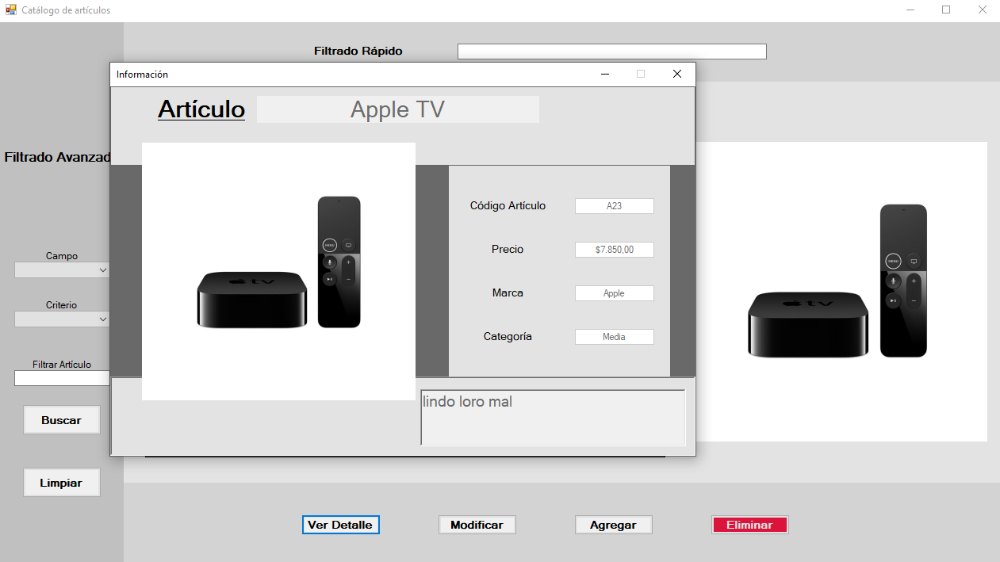
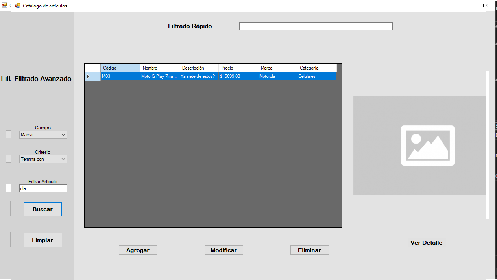
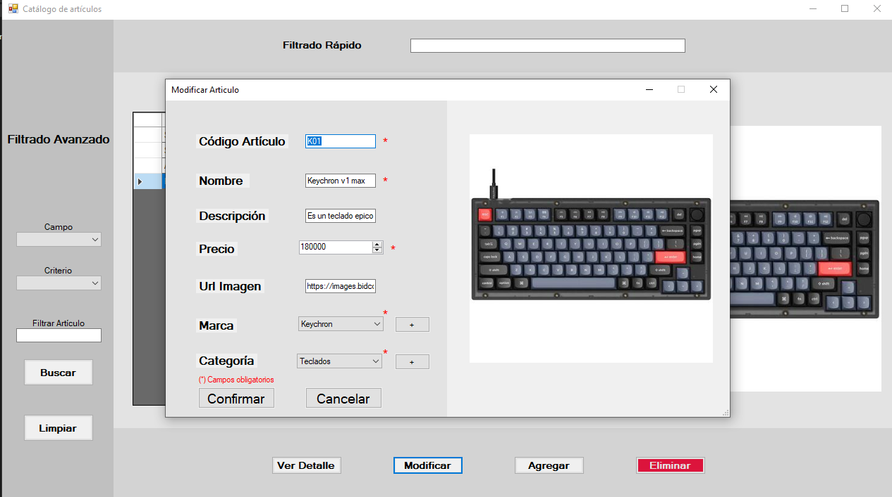
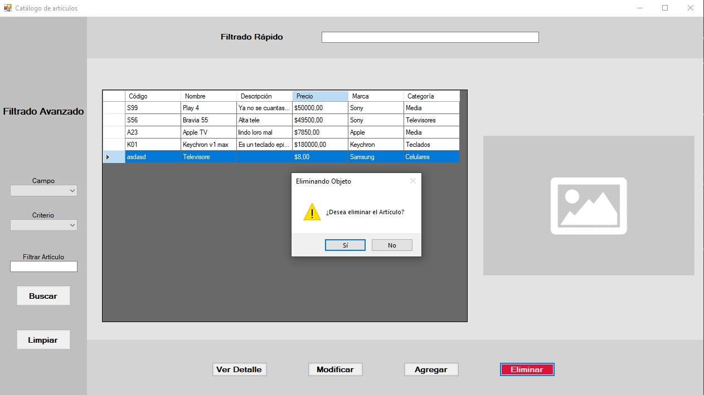

# Aplicación de Escritorio para Gestión de Artículos
Desarrollada como práctica integral de programación utilizando C#, .NET (WinForms) y SQL Server Express.
Permite administrar un catálogo de artículos con operaciones básicas de alta, baja, modificación, búsqueda y filtrado. El proyecto refuerza conceptos clave como acceso a bases de datos, arquitectura por capas, y manejo de formularios en entornos de escritorio.

## Ventana Detalle

## Ventana Filtro

## Ventana Modificacion

## Ventana Eliminación

