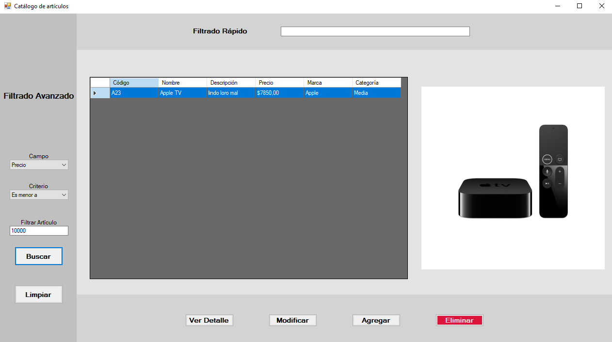

# Catálogo
Proyecto final C# /  .NET / SQL. 
Aplicación de escritorio desarrollada en .NET que permite la gestión de una base de datos de artículos generales.
Incluye funcionalidades para filtrar, agregar, modificar y eliminar registros desde una interfaz intuitiva.

## Ventana Detalle

## Ventana Filtro

## Ventana Modificacion

## Ventana Eliminación

